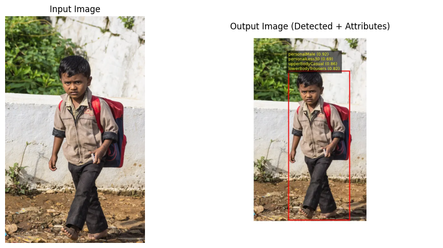

<!-- BADGES -->
<p align="center">
  <a href="https://github.com/KSPandian7/people-analytics/stargazers">
    
  </a>
  <a href="https://github.com/KSPandian7/people-analytics/network/members">
    
  </a>
  
  
  
  
  
</p>

<h1 align="center">Pedestrian Attribute Recognition & People Analytics System</h1>

<p align="center">
An end-to-end computer vision pipeline for detecting pedestrians and predicting semantic
attributes in real time using YOLO + ResNet with optimized inference (ONNX + OpenVINO).
</p>

---

## Table of Contents

- [Introduction](#introduction)
- [Objectives](#objectives)
- [Applications](#applications)
- [Dataset](#dataset)
- [System Architecture](#system-architecture-logical-flow)
- [Model Design](#model-design)
- [Training Strategy](#training-strategy)
- [Evaluation Metrics](#evaluation-metrics)
- [Deployment & Optimization](#deployment--optimization)
- [Web Application](#web-application-demo)
- [Results](#results)
- [Repository Structure](#repository-structure)
- [Setup & Usage](#setup--usage)
- [Future Work](#future-work)
- [License](#license)


## Introduction

Modern surveillance and retail systems require more than just detecting people — they need semantic understanding of pedestrians such as gender, age group, clothing style, and carried objects.

> This project presents an end-to-end People Analytics system that:

- Detects pedestrians in images<br>

- Extracts semantic attributes using deep learning<br>

- Applies confidence-based output screening<br>

- Provides real-time visual analytics via a web interface<br>

The system is designed to be deployment-ready, privacy-aware, and scalable.

## Objectives

> The main objectives of this project are:

- To design a multi-label pedestrian attribute recognition model
- To support multi-person analysis using object detection
- To present results visually for real-world usability

## Applications

> This system can be applied in:

### Retail Analytics

- Customer demographic analysis
- Clothing preference analysis
- Shopper intent detection (bags, backpacks)

### Smart Surveillance

- Attribute-based search (e.g., “male with backpack”)
- Crowd profiling without identity recognition
- Behavior and trend analysis

### Smart Cities

- Pedestrian flow analytics
- Urban planning insights
- Privacy-preserving people analytics

## Dataset
```bash

This project uses the "PETA (Pedestrian Attribute) dataset" for research and
evaluation purposes.

The PETA dataset is not distributed with this repository and is intended for academic and research use only. Users must download the dataset from the official source and comply with its original license terms.
```

> "PETA – Pedestrian Attribute Dataset"

- 4,500+ pedestrian images
- Annotated with binary semantic attributes

> Used attributes include:

- Gender
- Age group
- Upper/lower body clothing
- Carrying conditions

The dataset is suitable for **multi-label learning** and **real-world pedestrian analysis**.

## System Architecture (Logical Flow)

```python

Input Image
   ↓
YOLO Person Detection
   ↓
Crop Each Person
   ↓
CNN Attribute Recognition (ResNet18)
   ↓
Confidence-Based Screening
   ↓
Visual Output (Boxes + Attributes)

```

## Model Design

### Attribute Recognition Model

- Backbone: ResNet-18
- Task: Multi-label classification
- Loss: Binary Cross-Entropy with Logits
- Output: Independent probabilities per attribute

### Person Detection

- Pretrained YOLO model
- Detects multiple pedestrians in a single image
- Enables per-person attribute inference 

## Training Strategy

- Trained on GPU using PyTorch
- Train / validation split
- Data normalization aligned with ImageNet statistics
- Confidence-based decision thresholds applied post-inference

## Evaluation Metrics

- Precision, Recall, F1-Score (per attribute)
- Macro and weighted averages
- Confusion matrices for interpretability

#### Results show:

- Strong performance on frequent attributes
- Expected degradation on rare attributes due to dataset imbalance

## Deployment & Optimization

- Model exported to ONNX
- Converted to OpenVINO IR
- CPU inference benchmarking performed

### Performance:

- ~11 ms latency
- ~85 FPS throughput
- Real-time capable on CPU

## Output Screening

> A confidence-based screening layer is applied to:

- Suppress low-confidence predictions
- Improve stability of outputs
- Produce human-interpretable results

This step is critical for real-world deployment.

## Web Application (Demo)

> A Gradio-based web interface allows:

- Uploading images
- Visualizing detected people
- Displaying screened attributes per person

This makes the system demo-ready and interactive.

## Conclusion

This project demonstrates a **complete people analytics pipeline**, covering:

- Deep learning model development
- Evaluation and optimization
- Deployment-ready inference
- Visual and interactive output

The system is suitable for real-world surveillance and retail analytics scenarios.

## Future Work

- Temporal smoothing for video analysis
- Person Re-Identification (ReID)
- Edge deployment on embedded devices
- Bias and fairness analysis

### STEP-BY-STEP GUIDE (FOR GITHUB USERS)

```py
# 0. Start from here
git clone https://github.com/KSPandian7/people-analytics.git
cd people-analytics

# 1. Create environment
python -m venv env
env\Scripts\activate

# 2. Install dependencies
pip install torch torchvision ultralytics openvino gradio matplotlib seaborn

# 3. Train model
python src/train.py

# 4. Evaluate
python src/eval.py

# 5. Export model
python src/export_onnx.py
python src/convert_openvino.py

# 6. Run demo
python src/app.py

```
### Usage 

```py
python src/app.py
```

```py
python src/train.py
```

```py
python src/eval.py
```

```py
python src/export_onnx.py
python src/convert_openvino.py
python src/benchmark_openvino.py
```


#### Kewords:
Computer Vision, Deep Learning, PyTorch, YOLO, OpenVINO, ONNX,
Multi-Label Classification, CNN, People Analytics, Model Deployment
<hr>

### Sample Output


The system detects pedestrians and overlays predicted attributes using a confidence-based screening mechanism.

- Person detection using YOLO
- Attribute recognition using a CNN
- Visual overlay for interpretability

Note: Predictions are appearance-based and dataset-driven.


<h2>Sample Output Comparison</h2>

<table border="1" cellpadding="8" cellspacing="0">
  <thead>
    <tr>
      <th>Aspect</th>
      <th>Input Image</th>
      <th>System Output</th>
    </tr>
  </thead>
  <tbody>
    <tr>
      <td>Image Type</td>
      <td>Raw RGB image</td>
      <td>Annotated image with bounding box</td>
    </tr>
    <tr>
      <td>Pedestrian Detection</td>
      <td>Not available</td>
      <td>YOLO-based person detection</td>
    </tr>
    <tr>
      <td>Localization</td>
      <td>No localization</td>
      <td>Red bounding box around detected pedestrian</td>
    </tr>
    <tr>
      <td>Attribute Analysis</td>
      <td>Not available</td>
      <td>Deep learning–based multi-label classification</td>
    </tr>
    <tr>
      <td>Predicted Attributes</td>
      <td>None</td>
      <td>
        personalMale<br>
        personalLess30<br>
        upperBodyCasual<br>
        lowerBodyTrousers
      </td>
    </tr>
    <tr>
      <td>Confidence Scores</td>
      <td>Not available</td>
      <td>Displayed with each predicted attribute</td>
    </tr>
    <tr>
      <td>Output Filtering</td>
      <td>No filtering</td>
      <td>Confidence-based screening applied</td>
    </tr>
    <tr>
      <td>Interpretability</td>
      <td>Low</td>
      <td>High (visual + semantic overlay)</td>
    </tr>
    <tr>
      <td>Deployment Readiness</td>
      <td>Raw image only</td>
      <td>Optimized, real-time inference ready</td>
    </tr>
  </tbody>
</table>


## Structure
```base
people-analytics/
│
├── README.md
├── requirements.txt
├── LICENSE
│
├── data/
│   └── PETA/
│       └── PETA dataset/
│           └── CUHK/
│               └── archive/
│               └── Label.txt
│
├── models/
│   ├── peta_resnet18_attributes.pth
│   ├── peta_attributes.onnx
│   ├── peta_attributes_openvino.xml
│   └── peta_attributes_openvino.bin
│
├── notebooks/
│   └── Pedestrian_Attribute_Analytics_Demo.ipynb
│
├── src/
│   ├── config.py
│   ├── screening.py
│   ├── train.py
│   ├── eval.py
│   ├── export_onnx.py
│   ├── convert_openvino.py
│   ├── benchmark_openvino.py
│   └── app.py
│
├── scripts/
│   └── download_dataset.md
│
├── results/
│   ├── confusion_matrices/
│   ├── metrics/
│   └── sample_outputs/
│
└── .gitignore

```